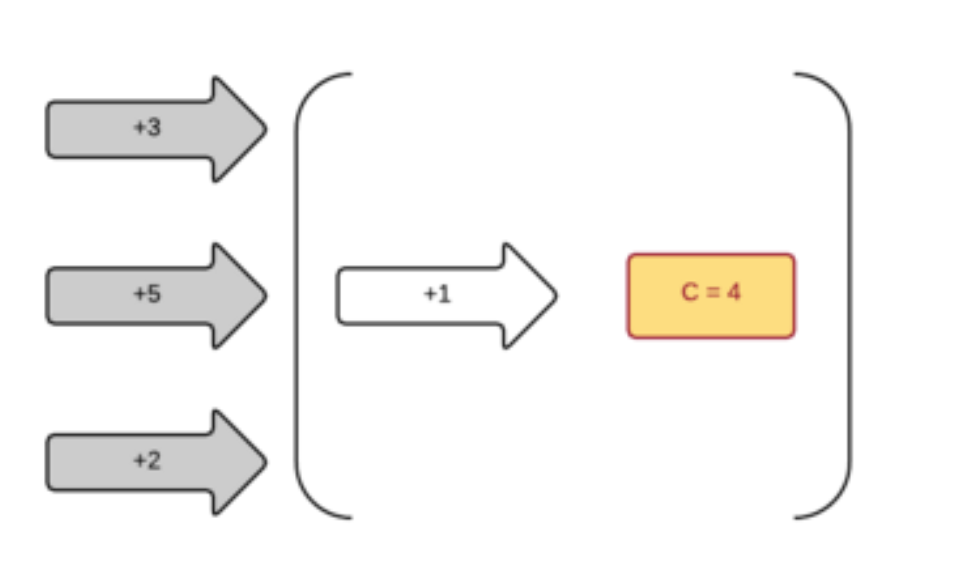
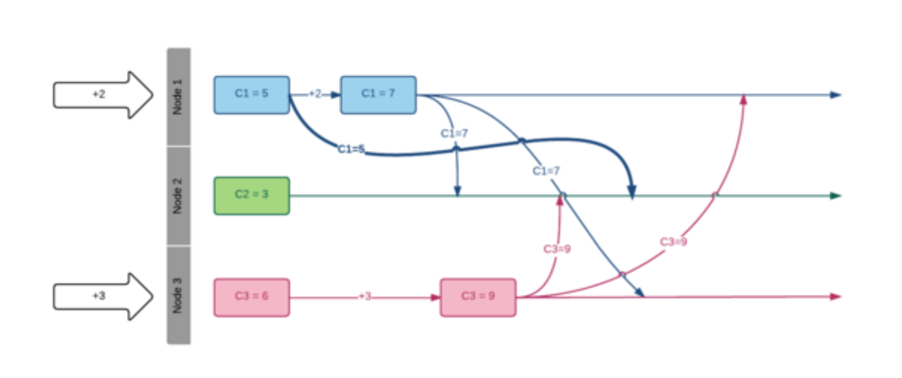

# Requirement 
- A value that is incremented by a given number and it yields a new value
# Synchronization approach 

- We loose parallization
- It can be improved using CAS(compare and swap)
    - Some user may be starving while they trying to update the counter under heavy load
    - It is better but not ideal
# Using queue 
- A single user increment the counter value
- other push incremental request into queue 

- It does improve throughput but the counter itself is not really distributed 
# Distributed counter 
- instead of one writer for whole system, let's have each node write it's own counter 
- Now each node write to it's own counter 
- Each node can write when it wants as it is only changing it's own value
- We have parallel increments 

- How to get counter final value?
- We need to sum up all the individual counter 
- How?
    - So every node needs to know every other node's value to get a global view of the counter 
    - Let's have node broadcast their values 

Following problems
- distributed world is not 100% reliable
- message can get lost
- message can be delayed 
## Solving duplicate messages
- on sender side, node can continuously broadcast their state
- on the receiving side, we need to a way to find out what to do with duplicates messages.
    - Node can compare the received value with the value already known for this node
    - if the values are same then it's a duplicate
    - otherwise new one
## Solve delayed message
- How to know if the received message is stale

### Approach 1: Counter can only move forward
- Keep the max between known and the received value
- At this point, every node knows what to do with received messages
- We have strong eventual consistencies because as soon as node has received all the events (in any order) it knows the current state of counter and this state is same for all nodes
This type of data structure is called CRDT(conflict free replicated data types)
We need to define three things
1. A set (eg positive integers)
2. A partial order (eg value keep increasing)
3. A binary operation that should be
    - associative: allow grouping in any order 
    - commutative: allow to process messages in any order
    - idempotent: allow to replay messages
    